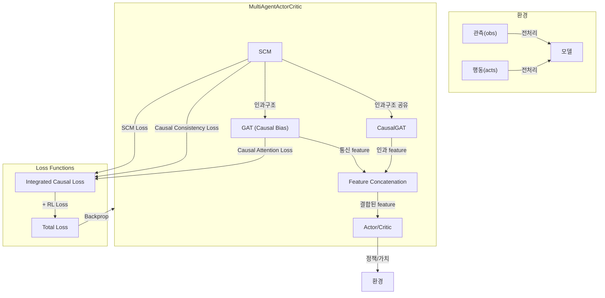

# [SCM/GAT 기반 Causal Reasoning 모델]

## 1. 전체 구조 개요
- 본 구조는 Multi-Agent 환경(특히 Dec-POMDP)에서 **인과 추론(causal reasoning)**을 통합한 Actor-Critic 계열 강화학습 모델임.
- 주요 구성요소:
    - **SCM(Structural Causal Model)**: 에이전트 간 인과관계 행렬 학습
    - **GAT(Graph Attention Network)**: SCM의 인과구조를 어텐션에 반영한 통신
    - **CausalGAT**: SCM과 인과구조를 공유하는 GAT
    - **Actor/Critic**: 각 에이전트별 정책/가치 함수
    - **중앙집중 Critic**: MADDPG 스타일의 중앙집중 가치 함수

---

## 2. 데이터 흐름 및 처리 과정

### (1) 환경에서의 데이터 흐름
- 각 step마다 환경(env)에서 다음과 같은 데이터가 생성됨:
    - `obs`: 각 에이전트의 관측값 (obs_dim)
    - `acts`: 각 에이전트의 행동 (action_dim)
    - `rews`: 각 에이전트의 보상
    - `vals`: 각 에이전트의 가치 추정치
    - `dones`: 종료 여부
- 이 데이터들은 trajectory로 저장되어, 학습 시 배치로 처리됨.

### (2) 모델 입력 및 전처리
- `obs`는 (batch, agents, obs_dim) 형태로 모델에 입력됨.
- `acts`는 (batch, agents) 또는 (batch, agents, action_dim) 형태로 one-hot encoding되어 사용됨.
- `preprocess_obs` 함수에서 numpy/tensor 타입 변환 및 device 전송이 이루어짐.

---

## 3. 모델 아키텍처 상세

### (1) SCM (Structural Causal Model)
```python
class SCM(nn.Module):
    def __init__(self, obs_dim, action_dim, hidden_dim, num_agents, use_causal_prior=True):
        # 인과구조 행렬 (학습/고정)
        if use_causal_prior:
            self.causal_matrix = nn.Parameter(torch.eye(num_agents), requires_grad=True)
        else:
            self.causal_matrix = nn.Parameter(torch.randn(num_agents, num_agents), requires_grad=True)
        
        # 각 agent별 인과 메커니즘
        self.causal_mechanisms = nn.ModuleList([...])
        
        # 각 agent별 노이즈 모델
        self.noise_models = nn.ModuleList([...])
```

- 각 에이전트 간 인과관계 행렬(softmax(causal_matrix))을 학습함.
- 각 에이전트별로 관측+행동을 받아 인과 메커니즘을 통과시킴.
- 인과구조 행렬을 통해 각 에이전트의 효과를 가중합하여 최종 예측을 만듦.
- 노이즈 모델을 통해 관측값에 노이즈를 추가함.

### (2) Graph Attention Layer (GAT) - Enhanced with Causal Bias
```python
class GraphAttentionLayer(nn.Module):
    def __init__(self, input_dim, output_dim, num_heads=4, dropout=0.1, alpha=0.2, concat=True, use_causal_bias=True):
        # 각 head별 선형변환
        self.W = nn.Parameter(torch.Tensor(num_heads, input_dim, output_dim))
        # 어텐션 메커니즘
        self.attention = nn.Parameter(torch.Tensor(num_heads, 2 * output_dim, 1))
        # Causal Attention Bias
        if use_causal_bias:
            self.causal_bias = nn.Parameter(torch.Tensor(num_heads, 1, 1))
```

- GAT 논문 기반 그래프 어텐션 레이어
- **Causal Attention Bias**: SCM의 인과구조를 어텐션 스코어에 직접 반영
- Multi-head attention으로 다양한 관점에서 어텐션 계산
- LeakyReLU를 사용한 어텐션 스코어 계산

### (3) CausalGAT
```python
class CausalGAT(nn.Module):
    def __init__(self, input_dim, hidden_dim, output_dim, num_heads=4, num_layers=2, 
                 dropout=0.1, scm_causal_matrix=None, use_causal_bias=True, num_agents=2):
        # GAT layers
        self.gat_layers = nn.ModuleList([...])
        
        # SCM의 인과구조를 공유하거나 독립적인 인과구조 사용
        if scm_causal_matrix is not None:
            self.causal_structure = scm_causal_matrix  # SCM과 공유
        else:
            self.causal_structure = nn.Parameter(torch.eye(num_agents), requires_grad=True)
```

- SCM의 인과구조를 공유하여 일관된 인과관계 모델링
- 단순화된 구조: 동적 인과구조 조정 기능 제거
- 기본 인과구조를 GAT 레이어에 전달하여 처리

### (4) MultiAgentActorCritic
```python
class MultiAgentActorCritic(nn.Module):
    def __init__(self, obs_dim, action_dim, hidden_dim=64, num_agents=2, 
                 use_gat=True, use_causal_gat=True, gat_dim=32, num_heads=4, 
                 dropout=0.1, share_causal_structure=True):
        # SCM (먼저 생성하여 인과구조 공유 가능)
        self.scm = SCM(obs_dim, action_dim, hidden_dim, num_agents)
        
        # GAT (SCM의 인과구조를 어텐션에 반영)
        if use_gat:
            self.gat = GraphAttentionLayer(obs_dim, gat_dim, num_heads, dropout, concat=False, use_causal_bias=True)
            
        # CausalGAT (SCM의 인과구조 공유)
        if use_causal_gat:
            scm_causal_matrix = self.scm.causal_matrix if share_causal_structure else None
            self.causal_gat = CausalGAT(obs_dim, gat_dim, gat_dim, num_heads, 2, dropout, 
                                       scm_causal_matrix=scm_causal_matrix,
                                       use_causal_bias=True, num_agents=num_agents)
        
        # Actor/Critic networks
        self.actor_networks = nn.ModuleList([...])
        self.critic_networks = nn.ModuleList([...])
        
        # 중앙집중 critic (MADDPG 스타일)
        self.centralized_critic = nn.Sequential([...])
```

- 각 에이전트별로 actor/critic 네트워크를 가짐.
- GAT과 CausalGAT의 출력을 concatenation하여 actor/critic 입력에 사용.
- 중앙집중 critic(MADDPG 스타일)도 구현되어 있음.

---

## 4. Causal Reasoning의 진행 방식

### (1) 인과구조 공유 메커니즘
```python
# SCM의 인과구조를 CausalGAT과 공유
scm_causal_matrix = self.scm.causal_matrix if share_causal_structure else None
self.causal_gat = CausalGAT(..., scm_causal_matrix=scm_causal_matrix)
```

### (2) GAT 어텐션에 인과구조 반영
```python
# SCM의 인과구조를 adj_matrix에 가중치로 적용
if self.share_causal_structure:
    causal_structure = self.scm.get_causal_structure()
    causal_adj = causal_structure.unsqueeze(0).expand(batch_size, -1, -1)
    adj_matrix = adj_matrix * causal_adj
```

### (3) Causal Attention Bias 적용
```python
# GraphAttentionLayer에서 인과구조를 어텐션 스코어에 직접 반영
if self.use_causal_bias and causal_structure is not None:
    causal_bias = causal_structure * causal_bias_expanded
    attention_scores = attention_scores + causal_bias
```

### (4) Feature Concatenation
```python
# GAT과 CausalGAT의 feature를 concatenation
if self.use_causal_gat and self.use_gat:
    causal_features = self.causal_gat(observations, adj_matrix)
    if communication_features is not None:
        communication_features = torch.cat([communication_features, causal_features], dim=-1)
```

### (5) 학습 흐름
1. **SCM 학습**: 환경 데이터로부터 agent 간 인과관계 학습
2. **인과구조 전파**: 학습된 인과구조가 GAT의 어텐션 가중치에 반영
3. **통신 최적화**: 인과관계가 강한 agent 간 더 많은 어텐션 부여
4. **정책 개선**: 인과구조를 고려한 더 효과적인 통신으로 정책 학습

---

## 5. Loss Function 구조

### (1) SCM Loss
```python
def compute_scm_loss(self, observations, actions, next_observations):
    scm_predictions = self.scm(observations, actions)
    scm_loss = F.mse_loss(scm_predictions, next_observations)
    return scm_loss
```
- SCM이 예측한 다음 관측값과 실제 next observation 간의 MSE loss
- $\text{SCM Loss} = \text{MSE}(\text{SCM}(obs, acts), next\_obs)$

### (2) Causal Consistency Loss
```python
def compute_causal_consistency_loss(self, causal_structure):
    sparsity_loss = torch.norm(causal_structure, p=1)
    identity = torch.eye(causal_structure.shape[0], device=causal_structure.device)
    identity_loss = F.mse_loss(causal_structure, identity)
    return sparsity_loss + identity_loss
```
- 인과구조 행렬의 sparsity(L1)와 identity(자기 자신에 대한 영향력 유도) loss의 합
- $\text{Causal Consistency Loss} = \|C\|_1 + \text{MSE}(C, I)$ 
- 여기서 $C$는 softmax된 인과구조 행렬, $I$는 단위행렬

### (3) Causal Attention Loss
```python
def compute_causal_attention_loss(self, observations, communication_features):
    if communication_features is None:
        return torch.tensor(0.0, device=observations.device)
    
    # 인과구조 기반 예상 통신 강도 계산
    causal_structure = self.scm.get_causal_structure()
    expected_communication = torch.bmm(
        causal_structure.unsqueeze(0).expand(observations.shape[0], -1, -1),
        observations
    )
    
    # 통신 특성과 예상 통신 간의 일관성 loss
    consistency_loss = F.mse_loss(
        communication_features.mean(dim=-1, keepdim=True),
        expected_communication.mean(dim=-1, keepdim=True)
    )
    return consistency_loss
```
- **목적**: SCM의 인과구조와 실제 통신 특성이 일치하도록 유도
- **의미**: "인과관계가 강한 agent들 간에는 실제로도 더 많은 통신이 일어나야 한다"
- $\text{Causal Attention Loss} = \text{MSE}(\text{comm\_features}, \text{expected\_comm})$

### (4) RL Loss (Actor-Critic)
```python
# Policy loss
policy_loss = -(F.log_softmax(logits, dim=-1).gather(1, act_t.unsqueeze(1)).squeeze(1) * adv_t).mean()

# Value loss
value_loss = F.mse_loss(values, gae_ret_t)

# Entropy
entropy = -(probs * F.log_softmax(logits, dim=-1)).sum(dim=-1).mean()

# Total RL loss
loss_rl = policy_loss + value_coef * value_loss - ent_coef * entropy
```
- 정책 손실: Advantage 기반 policy gradient
- 가치 손실: MSE(critic, GAE target)
- 엔트로피 보너스: 정책의 탐험성 유도
- $\text{RL Loss} = \text{Policy Loss} + \lambda_v \cdot \text{Value Loss} - \lambda_e \cdot \text{Entropy}$

### (5) Integrated Causal Loss
```python
def compute_integrated_causal_loss(self, observations, actions, next_observations, 
                                 communication_features, causal_weight=1.0, attention_weight=0.5):
    # SCM loss
    scm_loss = self.compute_scm_loss(observations, actions, next_observations)
    
    # Causal consistency loss
    causal_structure = self.scm.get_causal_structure()
    consistency_loss = self.compute_causal_consistency_loss(causal_structure)
    
    # Causal attention loss
    attention_loss = self.compute_causal_attention_loss(observations, communication_features)
    
    # 통합 loss
    total_loss = causal_weight * scm_loss + consistency_loss + attention_weight * attention_loss
    
    return total_loss
```

### (6) Total Loss
```python
total_loss = integrated_causal_loss + loss_rl
```
- $\text{Total Loss} = \text{Integrated Causal Loss} + \text{RL Loss}$
- $\text{Integrated Causal Loss} = \lambda_c \cdot \text{SCM Loss} + \text{Causal Consistency Loss} + \lambda_a \cdot \text{Causal Attention Loss}$

---

## 6. 학습 및 인과구조 시각화

### (1) 학습 과정
```python
# 각 step마다 인과구조 저장
self.causal_structure_list.append(causal_structure.detach().cpu().numpy())

# 학습 후 시각화
self.plot_causal_structure_evolution(output_dir)
```

### (2) 시각화 내용
- **Evolution plot**: 각 entry(에이전트 쌍)의 softmax weight 변화
- **Last heatmap**: 마지막 step의 인과구조 행렬
- **Training history**: 각종 loss 변화 추이 (SCM, Causal Consistency, Causal Attention, RL losses)

---

## 7. 요약 도식



---

## 8. 주요 특징

### (1) 인과구조 공유
- SCM에서 학습한 인과구조가 GAT과 CausalGAT에서 공유됨
- 일관된 인과관계 모델링으로 학습 안정성 향상

### (2) Causal Attention Bias
- SCM의 인과구조를 GAT의 어텐션 스코어에 직접 반영
- 인과관계가 강한 agent 간 더 많은 어텐션 부여

### (3) Causal Attention Loss
- SCM의 인과구조와 실제 통신 특성 간의 일관성 유도
- 의미있는 통신 패턴 학습

### (4) Feature Concatenation
- GAT과 CausalGAT의 feature를 독립적으로 보존하면서 결합
- 더 풍부한 통신 정보 제공

### (5) 단순화된 구조
- 동적 인과구조 조정 기능 제거로 복잡성 감소
- 명확하고 이해하기 쉬운 아키텍처

### (6) 중앙집중 Critic
- MADDPG 스타일의 중앙집중 가치 함수
- 모든 agent의 관측과 행동을 고려한 가치 추정

### (7) 인과구조 시각화
- 학습 과정에서의 인과구조 변화 추적
- 해석 가능한 인과관계 분석

---

## 9. Config 파라미터

### (1) 모델 파라미터
```yaml
model:
  hidden_dim: 64
  use_causal_prior: true
  use_gat: true
  use_causal_gat: true
  gat_dim: 32
  num_heads: 4
  dropout: 0.1
  share_causal_structure: true
```

### (2) 학습 파라미터
```yaml
params:
  lr: 0.001
  total_steps: 1000
  ep_num: 4
  gamma: 0.99
  gae_lambda: 0.95
  value_coef: 0.5
  ent_coef: 0.01
  causal_weight: 1.0      # SCM loss 가중치
  attention_weight: 0.5   # Causal attention loss 가중치
  cuda: true
```

---

## 10. 참고
- 본 구조는 Dec-POMDP 환경에서 각 에이전트의 관측/행동/인과관계를 통합적으로 학습하여, 인과적 reasoning과 효율적 협동을 동시에 달성하는 것을 목표로 함.
- SCM에서 학습한 인과구조가 GAT의 어텐션 메커니즘에 직접적으로 반영되어 더 효과적인 multi-agent 학습이 가능함.
- 단순화된 구조로 인해 디버깅과 이해가 용이하며, 핵심적인 인과추론 기능은 유지됨.


## 🔧 환경별 설정

### DecTiger
```yaml
dectiger:
  task: dectiger
  obs_dim: 16
  hidden_dim: 64
  gat_dim: 48
  z_dim: 24
  act_dim: 3
  nagents: 2
  use_gat: True
  use_causal_gat: False
  use_rnn: True
```

### MPE Simple Spread
```yaml
mpe:
  task: mpe_simple_spread
  nagents: 3
  hidden_dim: 64
  gat_dim: 64
  z_dim: 32
  use_gat: True
  use_causal_gat: False
  use_rnn: True
```

### Speaker-Listener
```yaml
speaker_listener:
  task: speaker_listener
  max_cycles: 25
  continuous_actions: False
```

## 🎯 지원 환경

### 1. DecTiger
- **설명**: 두 에이전트가 협력하여 호랑이가 있는 문을 찾는 환경
- **에이전트 수**: 2
- **액션**: Listen, Open-left, Open-right
- **특징**: 부분 관찰, 협력 필요

### 2. MPE (Multi-Agent Particle Environment)
- **Simple Spread**: 에이전트들이 랜드마크를 덮는 협력 환경
- **Speaker-Listener**: 스피커가 리스너에게 목표 위치를 전달하는 통신 환경
- **에이전트 수**: 3 (Simple Spread), 2 (Speaker-Listener)
- **특징**: 연속 공간, 물리 시뮬레이션

### 3. SMAX (StarCraft Multi-Agent Challenge)
- **설명**: StarCraft II 기반 전략 게임 환경
- **에이전트 수**: 5-10 (맵에 따라)
- **특징**: 복잡한 전략, 다양한 유닛 타입

### 4. Switch
- **설명**: 에이전트들이 스위치를 조작하여 목표를 달성하는 환경
- **에이전트 수**: 2-4
- **특징**: 순차적 협력, 부분 관찰

### 5. Predator-Prey
- **설명**: 포식자들이 협력하여 먹이를 잡는 환경
- **에이전트 수**: 2-4 (포식자)
- **특징**: 협력 사냥, 전략적 계획

### 6. Level-Based Foraging
- **설명**: 에이전트들이 협력하여 음식을 수집하는 환경
- **에이전트 수**: 2-8
- **특징**: 레벨 기반 협력, 자원 경쟁

## 📈 모니터링 및 실험 관리

### 자동 결과 저장

훈련 완료 후 모든 결과가 자동으로 `outputs/YYYY-MM-DD_HH-MM-SS/` 폴더에 저장됩니다:

```
outputs/2025-01-15_14-30-25/
├── config_blicket_2025-01-15_14-30-25.json    # 실험 설정
├── training_history.png                        # 훈련 히스토리 그래프
├── episode_returns.png                         # 에피소드 리턴 그래프
├── training_history.json                       # 훈련 데이터 (JSON)
└── episode_returns.json                        # 에피소드 리턴 데이터 (JSON)
```

### 설정 파일 구조

저장되는 설정 파일에는 다음 정보가 포함됩니다:

```json
{
  "env_name": "blicket",
  "env_config": {
    "n_agents": 3,
    "n_blickets": 3,
    "max_steps": 20
  },
  "model_config": {
    "hidden_dim": 64,
    "gat_dim": 32,
    "z_dim": 16,
    "use_gat": true,
    "use_causal_gat": false
  },
  "training_config": {
    "lr": 0.001,
    "gamma": 0.99,
    "total_steps": 2000,
    "mixed_precision": true
  },
  "seed": 42,
  "device": "cuda"
}
```

### 그래프에 하이퍼파라미터 표시

모든 그래프의 제목에 주요 하이퍼파라미터가 자동으로 표시됩니다:

```
Training History - blicket
lr: 0.001 | hidden_dim: 64 | gat_dim: 32 | z_dim: 16 | num_agents: 3 | use_gat: True
```

### 설정 로드 및 재현

저장된 설정을 로드하여 실험을 재현할 수 있습니다:

```python
from src.utils import load_experiment_config

# 설정 로드
config = load_experiment_config("outputs/2025-01-15_14-30-25/config_blicket_2025-01-15_14-30-25.json")

# 설정 정보 확인
print(f"환경: {config['env_name']}")
print(f"학습률: {config['training_config']['lr']}")
print(f"시드: {config['seed']}")
```

### TensorBoard 로깅
```bash
tensorboard --logdir logs
```

### 주요 메트릭
- VAE Loss (NLL, KL, Cooperation)
- RL Loss (Policy, Value, Entropy)
- Gradient Norms
- Episode Returns
- Success Rates

## 🐛 문제 해결

### GPU 메모리 부족
1. `batch_size` 줄이기
2. `mixed_precision: False`로 설정
3. `gradient_accumulation_steps` 증가

### CUDA 오류
1. PyTorch 버전 확인
2. CUDA 드라이버 업데이트
3. `cuda: False`로 CPU 모드 사용

## 📝 라이선스

이 프로젝트는 MIT 라이선스 하에 배포됩니다.

## 🤝 기여

버그 리포트, 기능 요청, 풀 리퀘스트를 환영합니다!

## 📚 참고 문헌

- Chung, J., et al. "A Recurrent Latent Variable Model for Sequential Data." NIPS 2015.
- Veličković, P., et al. "Graph Attention Networks." ICLR 2018.
- Lowe, R., et al. "Multi-Agent Actor-Critic for Mixed Cooperative-Competitive Environments." NIPS 2017.
