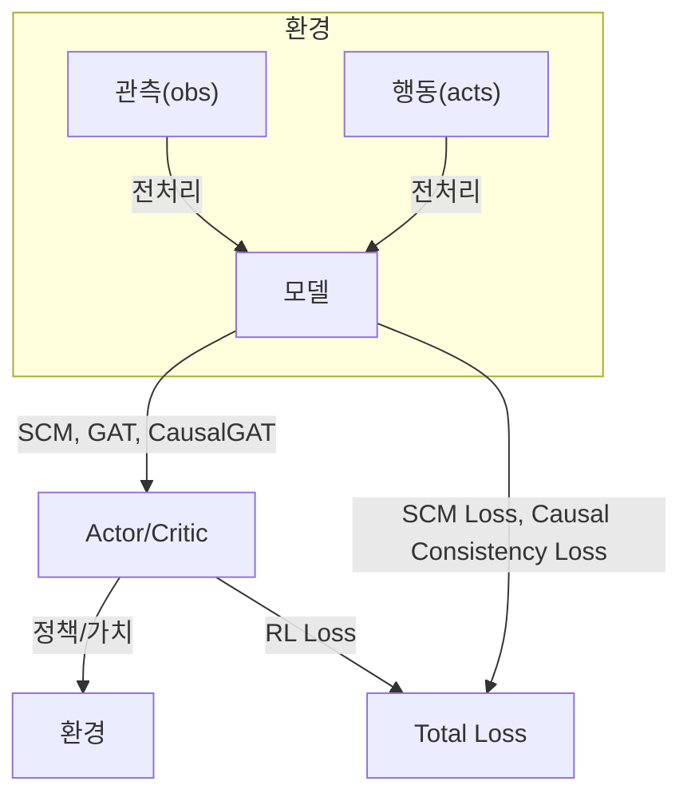

# [기본 VRNN-GAT 모델]

## 📋 **모델 개요**

### **핵심 아이디어**
- **VRNN (Variational RNN)**: 각 에이전트의 시퀀스 정보를 latent space에서 모델링
- **Multi-Head CausalGATLayer**: 4개의 독립적인 attention head로 다양한 추론 능력 구현
- **JSD-based Neighbor Selection**: Jensen-Shannon Divergence를 이용한 동적 neighbor 선택
- **Adaptive Loss Balancing**: VAE, RL, Communication loss의 동적 균형 조정

### **주요 특징**
- **Dec-POMDP 호환**: 각 에이전트는 자신의 관찰만 접근 가능
- **Multi-Head Attention**: 4개의 독립적인 attention head로 다양한 추론
- **End-to-end 학습**: VAE, RL, Communication loss를 동시에 최적화
- **Rolling Error Attention**: 예측 오차의 이동평균을 GAT attention에 반영
- **Layer Normalization**: 학습 안정성 향상
- **Ablation 지원**: GAT, CausalGAT, Head별 비활성화 옵션

## 🏗️ **모델 아키텍처**

```
┌─────────────────────────────────────────────────────────────────────────────────┐
│                    Multi-Head Causal VRNN-GAT Model                             │
└─────────────────────────────────────────────────────────────────────────────────┘

      ┌─────────────────┐    ┌─────────────────┐    ┌─────────────────┐
      │   Agent 1       │    │   Agent 2       │    │   Agent N       │
      │                 │    │                 │    │                 │
      │  ┌───────────┐  │    │  ┌───────────┐  │    │  ┌───────────┐  │
      │  │   VRNN    │  │    │  │   VRNN    │  │    │  │   VRNN    │  │
      │  │  Cell 1   │  │    │  │  Cell 2   │  │    │  │  Cell N   │  │
      │  └───────────┘  │    │  └───────────┘  │    │  └───────────┘  │
      └─────────────────┘    └─────────────────┘    └─────────────────┘
              │                       │                       │
              └───────────────────────┼───────────────────────┘
                                      │
                    ┌─────────────────────────────────┐
                    │    Multi-Head CausalGATLayer    │
                    │                                 │
                    │ ┌─────────────────────────────┐ │
                    │ │    Head 1: Standard         │ │
                    │ │      Attention              │ │
                    │ │  (Basic GAT + Delta Bias)   │ │
                    │ └─────────────────────────────┘ │
                    │                                 │
                    │ ┌─────────────────────────────┐ │ 
                    │ │    Head 2: Causal           │ │
                    │ │      Attention              │ │
                    │ │  (Pairwise Relationships)   │ │
                    │ └─────────────────────────────┘ │
                    │                                 │
                    │ ┌─────────────────────────────┐ │
                    │ │    Head 3: Temporal         │ │
                    │ │      Attention              │ │
                    │ │  (Temporal Dependencies)    │ │
                    │ └─────────────────────────────┘ │
                    │                                 │
                    │ ┌─────────────────────────────┐ │
                    │ │    Head 4: Situation-aware  │ │
                    │ │      Attention              │ │
                    │ │  (Context-dependent)        │ │
                    │ └─────────────────────────────┘ │
                    │                                 │
                    │ ┌─────────────────────────────┐ │
                    │ │    Head Fusion              │ │
                    │ │  (4-head Integration)       │ │
                    │ └─────────────────────────────┘ │
                    │                                 │
                    │ ┌─────────────────────────────┐ │
                    │ │    Layer Norm + Dropout     │ │
                    │ │  (Stability Enhancement)    │ │
                    │ └─────────────────────────────┘ │
                    └─────────────────────────────────┘
                                      │
              ┌───────────────────────┼───────────────────────┐
              │                       │                       │
      ┌─────────────────┐    ┌─────────────────┐    ┌─────────────────┐
      │  Policy Head 1  │    │  Policy Head 2  │    │  Policy Head N  │
      │                 │    │                 │    │                 │
      │ ┌─────────────┐ │    │ ┌─────────────┐ │    │ ┌─────────────┐ │
      │ │   Actor     │ │    │ │   Actor     │ │    │ │   Actor     │ │
      │ │  Network    │ │    │ │  Network    │ │    │ │  Network    │ │
      │ └─────────────┘ │    │ └─────────────┘ │    │ └─────────────┘ │
      │ ┌─────────────┐ │    │ ┌─────────────┐ │    │ ┌─────────────┐ │
      │ │   Critic    │ │    │ │   Critic    │ │    │ │   Critic    │ │
      │ │  Network    │ │    │ │  Network    │ │    │ │  Network    │ │
      │ └─────────────┘ │    │ └─────────────┘ │    │ └─────────────┘ │
      └─────────────────┘    └─────────────────┘    └─────────────────┘
```

## 🔄 **데이터 플로우**

### **1. Observation Processing**
```
Input: obs_t (N, obs_dim)
       a_prev (N, act_dim)  
       h_prev (N, hidden_dim)
       rolling_mean_error (N,) [optional]

Output: h_next, nlls, kls, zs, mus, logvars
```

### **2. VRNN Processing**
```
For each agent i:
  ┌─────────────────────────────────────────────────────────┐
  │ VRNN Cell i:                                            │
  │                                                         │
  │ 1. Prior: h_prev → mu_p, logvar_p                       │
  │ 2. Encoder: [obs_t, h_prev] → mu_q, logvar_q            │
  │ 3. Sampling: z_t ~ N(mu_q, exp(logvar_q))               │
  │ 4. Decoder: [z_t, h_prev] → mu_x, logvar_x              │
  │ 5. RNN: [obs_t, z_t, a_prev] → h_next                   │
  │ 6. Loss: NLL + KL divergence                            │
  └─────────────────────────────────────────────────────────┘
```

### **3. Multi-Head CausalGAT Communication**
```
Input: V_nodes = [h_next, zs] (N, hidden_dim + z_dim)
       prev_gat_output (N, head_dim) [optional]

┌─────────────────────────────────────────────────────────┐
│ Multi-Head CausalGATLayer:                              │
│                                                         │
│ Shared Transform:                                       │
│   W1(V) → Wh1 (N, hid_dim)                             │
│   W2(Wh1) → Wh2 (N, out_dim)                           │
│                                                         │
│ ┌─────────────────────────────────────────────────────┐ │
│ │ Head 1: Standard Attention                          │ │
│ │   src1 + dst1 + delta_bias → alpha1                 │ │
│ │   H1 = alpha1 @ Wh1 → H1_proj (N, head_dim)        │ │
│ └─────────────────────────────────────────────────────┘ │
│                                                         │
│ ┌─────────────────────────────────────────────────────┐ │
│ │ Head 2: Causal Attention                            │ │
│ │   For each pair (i,j):                              │ │
│ │     causal_encoder([V[i], V[j]]) → causal_feat     │ │
│ │     causal_attn(causal_feat) → causal_score        │ │
│ │   causal_scores → alpha2 → H2_proj (N, head_dim)   │ │
│ └─────────────────────────────────────────────────────┘ │
│                                                         │
│ ┌─────────────────────────────────────────────────────┐ │
│ │ Head 3: Temporal Attention                          │ │
│ │   temporal_encoder([V, prev_hidden]) → temp_feat   │ │
│ │   temporal_attn(temp_feat) → temp_scores           │ │
│ │   temp_scores → alpha3 → H3_proj (N, head_dim)     │ │
│ └─────────────────────────────────────────────────────┘ │
│                                                         │
│ ┌─────────────────────────────────────────────────────┐ │
│ │ Head 4: Situation-aware Attention                   │ │
│ │   situation_encoder(V) → situation_feat            │ │
│ │   situation_attn(situation_feat) → situation_scores│ │
│ │   situation_scores → alpha4 → H4_proj (N, head_dim)│ │
│ └─────────────────────────────────────────────────────┘ │
│                                                         │
│ Head Fusion:                                            │
│   [H1_proj, H2_proj, H3_proj, H4_proj] → H_concat     │
│   head_fusion(H_concat) → H_fused                      │
│   layer_norm(H_fused) → H_output                       │
│                                                         │
│ Output: H_output (N, out_dim)                          │
└─────────────────────────────────────────────────────────┘
```

### **4. Policy Generation**
```
For each agent i:
  ┌─────────────────────────────────────────────────────────┐
  │ Policy Head i:                                          │
  │                                                         │
  │ Input: [obs[i], h_next[i], V_gat[i]]                   │
  │        (obs_dim + hidden_dim + gat_dim)                │
  │                                                         │
  │ Actor: input → action_logits (act_dim)                  │
  │ Critic: input → value (1)                               │
  │                                                         │
  │ Output: policy_logits, value                            │
  └─────────────────────────────────────────────────────────┘
```

## 🎯 **Loss Functions**

### **1. VAE Loss**
```
L_VAE = nll_coef × NLL + kl_coef × KL + coop_coef × Cooperative_KL

- NLL: Negative Log-Likelihood (reconstruction loss)
- KL: KL divergence between prior and posterior
- Cooperative_KL: Pairwise KL between agent latents
```

### **2. RL Loss**
```
L_RL = Policy_Loss + value_coef × Value_Loss - ent_coef × Entropy

- Policy_Loss: -(log_prob × advantage).mean()
- Value_Loss: MSE(value_pred, returns)
- Entropy: -(probs × log_probs).sum(-1).mean()
```

### **3. Communication Loss**
```
L_Comm = 0 (현재는 비활성화)

- Communication을 GAT로 대체하여 단순화
```

### **4. Adaptive Loss Balancing**
```
vae_coef, rl_coef, comm_coef = adaptive_loss_coefficients(loss_vae, loss_rl, loss_comm)
L_Total = vae_coef × L_VAE + rl_coef × L_RL + comm_coef × L_Comm
```

## 📊 **모델 통계**

### **파라미터 분포 (64:48:24 설정, 4 heads)**
```
VRNNCell:                   60,544 (57%)
Multi-Head CausalGATLayer:  18,432 (17%)
Policy Heads:               32,040 (30%)
─────────────────────────
Total:                     111,016 (100%)
```

### **차원 정보**
```
Input:     obs_dim = 16
Hidden:    hidden_dim = 64
Latent:    z_dim = 24
GAT:       gat_dim = 48
Head:      head_dim = 12 (gat_dim // 4)
Action:    act_dim = 3
Agents:    n_agents = 2
Heads:     n_heads = 4
```

## 🔧 **주요 하이퍼파라미터**

### **모델 구조**
- `hidden_dim : gat_dim : z_dim = 2.7 : 2 : 1`
- `n_heads = 4`: 4개의 독립적인 attention head
- `head_dim = gat_dim // n_heads = 12`: 각 head의 차원
- Rolling window size: 10
- JSD update frequency: 매 스텝

### **Multi-Head CausalGATLayer 설정**
- **Head 1**: Standard attention (기본 GAT + delta bias)
- **Head 2**: Causal attention (pairwise relationships)
- **Head 3**: Temporal attention (temporal dependencies)
- **Head 4**: Situation-aware attention (context-dependent)
- **Head Fusion**: 4개 head 출력 결합
- **Layer Normalization**: 학습 안정성
- **Dropout**: 0.6

### **학습 설정**
- Learning rate: 3e-4 (RL), 1e-4 (VAE)
- Loss coefficients: nll_coef=1.0, kl_coef=0.1, coop_coef=0.01
- GAE parameters: γ=0.99, λ=0.95
- Gradient clipping: max_grad_norm=0.5
- EMA: ema_alpha=0.99

## 🚀 **사용법**

### **모델 생성**
```python
model = VRNNGATA2C(
    obs_dim=16,
    act_dim=3,
    hidden_dim=64,
    z_dim=24,
    gat_dim=48,
    n_agents=2,
    use_gat=True,
    use_causal_gat=True,  # Multi-head CausalGATLayer 사용
)
```

### **Forward Pass**
```python
h_next, nlls, kls, logits, ref_logits, values, mus, logvars, zs, V_gat, comm_recons = \
    model.forward_step(obs, a_prev, h_prev, rolling_mean_error)
```

### **Config 설정**
```yaml
dectiger:
  use_causal_gat: true
  n_heads: 4
  max_grad_norm: 0.5
  ema_alpha: 0.99
```

## 🎯 **장점**

1. **다양한 추론 능력**: 4개의 독립적인 attention head로 서로 다른 추론 수행
2. **인과관계 모델링**: Causal attention으로 pairwise relationships 학습
3. **시간적 의존성**: Temporal attention으로 시퀀스 정보 활용
4. **상황 인식**: Situation-aware attention으로 context 고려
5. **학습 안정성**: Layer normalization, dropout, head fusion
6. **표현력**: VRNN으로 시퀀스 정보 모델링
7. **통신**: GAT로 효율적인 agent 간 정보 교환
8. **유연성**: 다양한 ablation study 지원
9. **확장성**: 다양한 환경에 적용 가능

## 🔬 **Ablation Study 옵션**

1. **Head별 Ablation**: 각 attention head 개별 비활성화
2. **Standard GAT vs Multi-Head CausalGAT**: `use_causal_gat`
3. **GAT Ablation**: `use_gat=False`
4. **Communication Ablation**: Communication loss 제거
5. **Temporal Reasoning Ablation**: prev_hidden=None
6. **Head Fusion Ablation**: 단순 concatenation vs fusion layer
7. **Layer Norm Ablation**: normalization 제거

## 🧠 **각 Head의 역할**

### **Head 1: Standard Attention**
- 기본적인 GAT attention mechanism
- Rolling error bias로 예측 오차 반영
- 에이전트 간 기본적인 정보 교환

### **Head 2: Causal Attention**
- Pairwise causal relationships 모델링
- 에이전트 간 인과관계 학습
- "A가 B에게 미치는 영향" 같은 인과적 관계 파악

### **Head 3: Temporal Attention**
- 시간적 의존성 모델링
- 이전 GAT 출력을 활용한 temporal reasoning
- 시퀀스 정보의 시간적 패턴 학습

### **Head 4: Situation-aware Attention**
- 현재 상황에 따른 context-dependent attention
- 각 에이전트의 상황을 고려한 attention
- 환경 변화에 따른 적응적 정보 교환

---

# [SCM/GAT 기반 Causal Reasoning 모델]
## 1. 전체 구조 개요
- 본 구조는 Multi-Agent 환경(특히 Dec-POMDP)에서 **인과 추론(causal reasoning)**을 통합한 Actor-Critic 계열 강화학습 모델임.
- 주요 구성요소:
    - **SCM(Structural Causal Model)**: 에이전트 간 인과관계 행렬 학습
    - **GAT(Graph Attention Network)**: 에이전트 간 정보 교환(커뮤니케이션)
    - **CausalGAT**: 인과구조를 반영한 GAT
    - **Actor/Critic**: 각 에이전트별 정책/가치 함수
    - 
---

## 2. 데이터 흐름 및 처리 과정

### (1) 환경에서의 데이터 흐름
- 각 step마다 환경(env)에서 다음과 같은 데이터가 생성됨:
    - `obs`: 각 에이전트의 관측값 (obs_dim)
    - `acts`: 각 에이전트의 행동 (action_dim)
    - `rews`: 각 에이전트의 보상
    - `vals`: 각 에이전트의 가치 추정치
    - `dones`: 종료 여부
- 이 데이터들은 trajectory로 저장되어, 학습 시 배치로 처리됨.

### (2) 모델 입력 및 전처리
- `obs`는 (batch, agents, obs_dim) 형태로 모델에 입력됨.
- `acts`는 (batch, agents) 또는 (batch, agents, action_dim) 형태로 one-hot encoding되어 사용됨.
- `preprocess_obs` 함수에서 numpy/tensor 타입 변환 및 device 전송이 이루어짐.

---

## 3. 모델 아키텍처 상세

### (1) SCM (Structural Causal Model)
- 각 에이전트 간 인과관계 행렬(softmax(causal_matrix))을 학습함.
- 각 에이전트별로 관측+행동을 받아 인과 메커니즘을 통과시킴.
- 인과구조 행렬을 통해 각 에이전트의 효과를 가중합하여 최종 예측을 만듦.
- 노이즈 모델을 통해 관측값에 노이즈를 추가함.

### (2) GAT / CausalGAT
- GAT: 에이전트 간의 커뮤니케이션을 attention 기반으로 모델링.
- CausalGAT: 인과구조 행렬을 softmax로 변환하여 입력에 곱한 뒤 GAT에 전달, 인과적 정보 흐름을 반영.

### (3) MultiAgentActorCritic
- 각 에이전트별로 actor/critic 네트워크를 가짐.
- GAT/CausalGAT의 출력(feature)을 actor/critic 입력에 concat하여 사용.
- 중앙집중 critic(MADDPG 스타일)도 구현되어 있음.
- forward 시 SCM, GAT, CausalGAT, actor, critic, centralized critic, communication feature, causal structure 등을 모두 반환.

---

## 4. Causal Reasoning의 진행 방식
- SCM의 인과구조 행렬(softmax(causal_matrix))이 학습을 통해 각 에이전트 간 인과적 영향력을 표현함.
- CausalGAT에서는 이 인과구조를 입력 feature에 곱해 attention에 반영함으로써, 인과적 정보 흐름이 네트워크 전체에 반영됨.
- 학습이 진행됨에 따라 인과구조 행렬이 변화하며, 이는 시각화(heatmap, evolution plot)로 확인 가능.

---

## 5. Loss Function 구조

### (1) SCM Loss
- SCM이 예측한 다음 관측값과 실제 next observation 간의 MSE loss
- $\text{SCM Loss} = \text{MSE}(\text{SCM}(obs, acts), next\_obs)$

### (2) Causal Consistency Loss
- 인과구조 행렬의 sparsity(L1)와 identity(자기 자신에 대한 영향력 유도) loss의 합
- $\text{Causal Consistency Loss} = \|C\|_1 + \text{MSE}(C, I)$ 
- 여기서 $C$는 softmax된 인과구조 행렬, $I$는 단위행렬

### (3) RL Loss (Actor-Critic)
- 정책 손실: Advantage 기반 policy gradient
- 가치 손실: MSE(critic, GAE target)
- 엔트로피 보너스: 정책의 탐험성 유도
- $\text{RL Loss} = \text{Policy Loss} + \lambda_v \cdot \text{Value Loss} - \lambda_e \cdot \text{Entropy}$

### (4) Total Loss
- $\text{Total Loss} = \text{SCM Loss} + \text{Causal Consistency Loss} + \text{RL Loss}$

---

## 6. 학습 및 인과구조 시각화
- 학습 중 각 step마다 인과구조 행렬을 저장하여, 학습이 끝난 후 변화 추이와 최종 구조를 시각화함.
- evolution plot: 각 entry(에이전트 쌍)의 softmax weight 변화
- last heatmap: 마지막 step의 인과구조 행렬

---

## 7. 요약 도식


---

## 8. 참고
- 본 구조는 Dec-POMDP 환경에서 각 에이전트의 관측/행동/인과관계를 통합적으로 학습하여, 인과적 reasoning과 효율적 협동을 동시에 달성하는 것을 목표로 함.